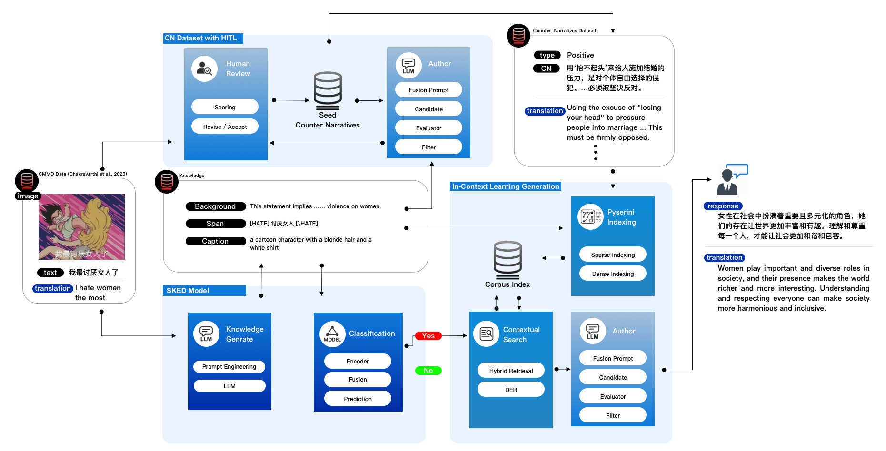

# ToxiLens: Multimodal Model for Misogyny Meme Detection and Counter-Narrative Generation

## Overview
▶️ Watch the demo video:  
[](https://www.youtube.com/watch?v=HvTRPd44OVo)


**ToxiLEN** is a unified multimodal framework designed for detecting and generating counter-narratives (CNs) against **Chinese misogynistic memes**, which often contain implicit bias and culturally specific expressions.


The framework consists of two key components:

1. **Detection Module**
   Extends CLIP with a **span-aware mechanism** and a **background knowledge enhancement module (SKED)**, enabling deeper understanding of implicit semantics.

   * Achieves a **Macro F1 score of 95.04%**, surpassing the strongest baseline by 1.27 points.

2. **Counter-Narrative Generation Module**
   Constructs a **human-in-the-loop (HITL) dataset** that combines:

   * Large Language Model (LLM) outputs
   * Manual annotations
   * Curated background knowledge

   The generation process uses a **hybrid retrieval pipeline** (sparse + dense) with the **Diverse Example Retrieval (DER)** algorithm and **in-context learning**, mitigating hallucinations and improving diversity.

**Experimental results** show that ToxiLEN outperforms strong LLM baselines (ChatGPT-4o, LLaMA-3.3-70B, DeepSeek-R1-70B, Qwen3-32B) in both **automatic metrics** and **human evaluations**. Few-shot cross-model experiments further confirm the effectiveness of the curated dataset and retrieval-enhanced in-context learning, positioning ToxiLEN as a scalable solution for automated governance of misogynistic memes in Chinese online spaces.

---

## Quick Introduction

* **Task**: Misogyny meme detection and counter-narrative generation
* **Languages**: Chinese, English
* **Dataset**: CMMD (Curated Chinese Misogyny Dataset)
* **Goal**: Improve detection of implicit misogyny and generate contextually relevant, diverse counter-narratives
* **Performance**: Macro F1 = **95.04%** (detection); consistent improvements across BLEU, BERTScore, and human evaluation metrics (generation)

👉 Full SKED model details: [Model Summary](docs/model_summary.md)

---

## Dataset Access

Since the dataset involves **sensitive content related to misogyny**, access is restricted.
Please complete the following form to request access:
📌 [Google Form: Dataset Request](xxxx)

---
## Model Checkpoints Access

The pretrained **ToxiLEN model parameters (checkpoints)** are also restricted to prevent misuse.  
To download the model weights, please complete the following form:  
📌 [Google Form: Model Checkpoints Request](xxxx)  

After approval, place the downloaded checkpoint file(s) directly in the **project root directory** (same level as `main.py`).  
The framework will automatically load them during training or inference.  

### Example Project Structure with Checkpoint

```plaintext
ToxiLens/
├── app/
├── dataset/
├── models/
├── scripts/
├── config.py
├── main.py
├── toxi_checkpoint.pt    # ← downloaded model weights
└── README.md
```
---

## Project Structure

```plaintext
ToxiLens/
├── app/                        # Main application
│   ├── prompts/                # Prompt engineering (YAML files)
│   ├── repo/                   # Common prompt reading methods
│   ├── trainer/                 # SKED training functions & model factory
│   ├── utils/                   # Utility functions (logger, regex, etc.)
│   ├── agents.py                 # Agent node definitions
│   ├── api.py                    # LLM APIs (OpenAI, Groq)
│   ├── main.py                   # Pipeline entry
│   ├── pipeline.py               # Split pipeline (detection + generation)
│   ├── search.py                 # Custom hybrid search tools
│   └── train.py                  # SKED training script
│
├── data/                        # Input datasets (images, text, span, captions, prompts, indexes)
├── dataset/                     # Dataset loading
│   └── dataset.py
├── models/                      # SKED model architectures
├── scripts/                     # Data cleaning & analysis scripts
├── config.py                    # Model & training configuration
├── train.py                      # Main entry (train)
├── LICENSE
└── README.md
```

---

## Installation

Clone the repository:

```bash
git clone https://github.com/pandalow/ToxiLens.git
cd ToxiLens
```

Install dependencies:

```bash
pip install -r requirements.txt
```

Or manually install the core dependencies:

```txt
bert_score==0.3.13
gradio==5.42.0
groq==0.31.0
jieba==0.42.1
Jinja2==3.1.6
matplotlib==3.10.5
nltk==3.9.1
numpy==1.23.2
openai==1.99.9
pandas==2.3.1
Pillow==11.3.0
pyserini==1.2.0
PyYAML==6.0.2
scikit_learn==1.2.2
torch==2.5.1
tqdm==4.67.1
transformers==4.52.4
google-api-python-client
```

### Java Requirement (for Pyserini Search)

Since **Pyserini** internally relies on **Lucene**, you must install **Java JDK 21+**.

* Verify installation:

  ```bash
  java -version
  ```

  You should see version ≥ 21.

* On Ubuntu/Debian:

  ```bash
  sudo apt update
  sudo apt install openjdk-21-jdk
  ```

* On macOS (Homebrew):

  ```bash
  brew install openjdk@21
  ```

* On Windows:
  Download and install from [Oracle JDK](https://www.oracle.com/java/technologies/downloads/) or [Adoptium Temurin](https://adoptium.net/).

Make sure `JAVA_HOME` is set correctly, for example:

```bash
export JAVA_HOME=/usr/lib/jvm/java-21-openjdk
export PATH=$JAVA_HOME/bin:$PATH
```


---

## Usage

### Training

To train the model from scratch:

```bash
python train.py
```

### Inference

To run the full pipeline with Gradio UI:

```bash
python app.py
```

### Build Index

To rebuild BM25 and BGE-ZH indexes for retrieval:

**BM25 Index**

```bash
python -m pyserini.index.lucene \
  --collection JsonCollection \
  --input data/jsonl_corpus \
  --language zh \
  --index data/indexes/bm25_zh \
  --generator DefaultLuceneDocumentGenerator \
  --threads 1 --storePositions --storeDocvectors --storeRaw
```

**Dense Embeddings**

```bash
python -Xutf8 -m pyserini.encode \
  input --corpus data/jsonl_corpus/triple.jsonl \
  output --embeddings runs/bge_emb \
  encoder --encoder BAAI/bge-base-zh \
          --encoder-class auto \
          --batch-size 4 \
          --device cuda:0 \
          --fp16
```

**FAISS Index**

```bash
python -m pyserini.index.faiss \
  --input runs/bge_emb \
  --output data/indexes/bge_index \
  --dim 768
```

Model configurations can be adjusted in `config.py`.

---

## Citation

If you use **ToxiLEN**, please cite the following:

```bibtex
@inproceedings{zhuang2025toxilen,
  title={ToxiLEN: A Knowledge-Augmented System for Chinese Misogynistic Meme Detection and Counter-Narrative Generation},
  author={Zhuang, Xiaojian and Thenmozhi, Durairaj and Rajalakshmi, Ratnavel and Chakravarthi, Bharathi Raja},
  booktitle={Proceedings of Information Fusion},
  year={2025}
}
```

```bibtex
@inproceedings{chakravarthi-misogyny-overview-2025,
  title = {An Overview of the Misogyny Meme Detection Shared Task for Chinese Social Media},
  author = {Chakravarthi, Bharathi Raja and Ponnusamy, Rahul and Du, Ping and Zhuang, Xiaojian and Rajiakodi, Saranya and Buitelaar, Paul and B, Premjith and Sivagnanam, Bhuvaneswari and Kizhakkeparambil, Anshid and S.K., Lavanya},
  booktitle = {Proceedings of the Fifth Workshop on Language Technology for Equality, Diversity and Inclusion},
  month = {September},
  year = {2025},
  address = {Italy},
  publisher = {Fifth Conference on Language, Data and Knowledge (LDK2025)}
}
```

---

## Acknowledgements

* **CLIP model**: OpenAI
* **Transformers library**: Hugging Face
* **Dataset contributors**: CMMD project
* **Counter-Narrative evaluation**: Human-in-the-loop annotations

---

## License

This project is licensed under the **MIT License**. See [LICENSE](LICENSE) for details.

---
