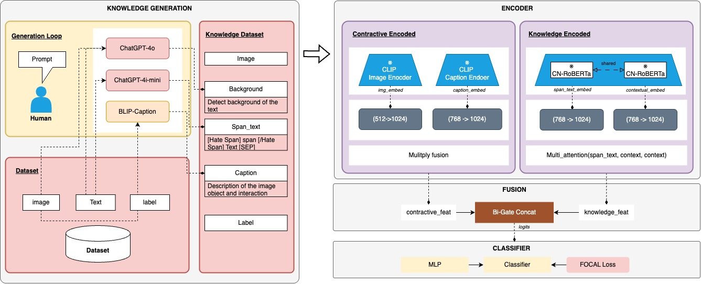

# 🧠 SKED Model Summary

This document provides an overview of the **SKED-enhanced MemeMultimodalDetector** architecture, its input/output interface, dimensional flow, and configuration parameters, designed for **Chinese misogynistic meme detection**.

---

## Model Purpose

The model is built to detect and classify memes based on both **visual** and **textual** content, including span-level semantic reasoning. It fuses CLIP features with auxiliary span/caption/knowledge representations using a **bi-gated fusion mechanism**, and employs **Focal Loss** to handle class imbalance.

---

## Model Components

| Component          | Description                                                                                            | Dimension (from `config`) |
| ------------------ | ------------------------------------------------------------------------------------------------------ | ------------------------- |
| `clip_encoder`     | CLIP backbone (`openai/clip-vit-base-patch32`) for image + text embeddings.                            | Image: 768, Text: 512     |
| `caption_encoder`  | BLIP caption features describing meme objects & interactions.                                          | 768                       |
| `detr_encoder`     | DETR object-detection embeddings for region-level features.                                            | 1024                      |
| `span_encoder`     | CN-RoBERTa encoder for span-level embeddings.                                                          | 768                       |
| `projection_layer` | Projects all features to a unified space before fusion.                                                | 1024                      |
| `bi-gate fusion`   | Custom bi-gated mechanism combining contractive (image+caption) and knowledge (span+context) features. | 2048 fused                |
| `mlp` (hidden)     | Intermediate MLP for compression.                                                                      | 1024                      |
| `classifier`       | Final classifier (2-way softmax).                                                                      | 2 classes                 |
| `loss`             | Focal Loss (`alpha=0.25`, `gamma=2.0`) to handle imbalance.                                            | -                         |

---

## Input Format

* **image**: A PIL image or tensor `[B, 3, 224, 224]`
* **text**: Meme textual caption (string)
* **span**: Extracted span phrase(s) (string)
* **caption (optional)**: BLIP-generated caption of the meme image
* **labels (optional)**: Class index (`0 = Non-Misogynistic`, `1 = Misogynistic`)

---

## Forward Pass Shape Trace

| Stage                       | Variable Name    | Output Shape | Dimension Source |
| --------------------------- | ---------------- | ------------ | ---------------- |
| CLIP Image Encoder          | `clip_img_feat`  | `[B, 768]`   | `clip_img_dim`   |
| CLIP Text Encoder           | `clip_text_feat` | `[B, 512]`   | `clip_text_dim`  |
| Caption Encoder             | `caption_feat`   | `[B, 768]`   | `caption_dim`    |
| DETR Encoder                | `detr_feat`      | `[B, 1024]`  | `detr_dim`       |
| Span Encoder (CN-RoBERTa)   | `span_feat`      | `[B, 768]`   | `span_dim`       |
| Projected Image/Text/Span   | `proj_*`         | `[B, 1024]`  | `proj_dim`       |
| Contractive Fusion (I+T)    | `contractive`    | `[B, 1024]`  | unified          |
| Knowledge Fusion (span+ctx) | `knowledge`      | `[B, 1024]`  | unified          |
| Bi-Gate Fusion              | `fused_logits`   | `[B, 2048]`  | `2 × proj_dim`   |
| MLP Compression             | `mlp_out`        | `[B, 1024]`  | `hidden_dim`     |
| Classifier Output           | `logits`         | `[B, 2]`     | `num_classes`    |

---

## Training Configuration

| Parameter         | Value                          |
| ----------------- | ------------------------------ |
| `device`          | `cuda` / `cpu`                 |
| `clip_model_name` | `openai/clip-vit-base-patch32` |
| `batch_size`      | 8                              |
| `epochs`          | 20                             |
| `num_classes`     | 2                              |
| `num_latents`     | 1                              |

---

## Loss Function

* **Loss**: Focal Loss (`alpha=0.25`, `gamma=2.0`)
* **Why**: Handles class imbalance (non-misogynistic memes dominate), focuses training on harder positive samples.

---

## Notes

* All features are projected to **1024 dimensions** (`proj_dim`) before fusion.
* **Bi-Gate Fusion** balances contributions from **contractive features** (image+caption) and **knowledge features** (span+context).
* Human-in-the-loop knowledge generation ensures context for **implicit misogyny detection**.

---

## References

* **CLIP**: [OpenAI CLIP paper](https://openai.com/research/clip)
* **RoBERTa (Chinese)**: [hfl/chinese-roberta-wwm-ext](https://huggingface.co/hfl/chinese-roberta-wwm-ext)
* **Focal Loss**: [Lin et al., 2017 - Focal Loss for Dense Object Detection](https://arxiv.org/abs/1708.02002)

